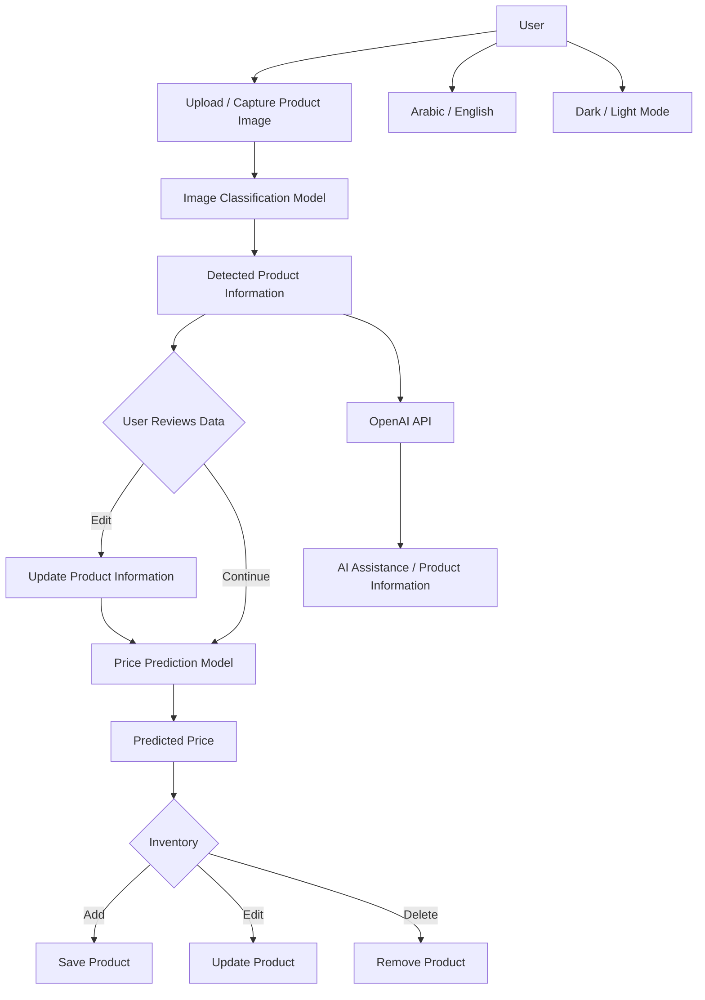
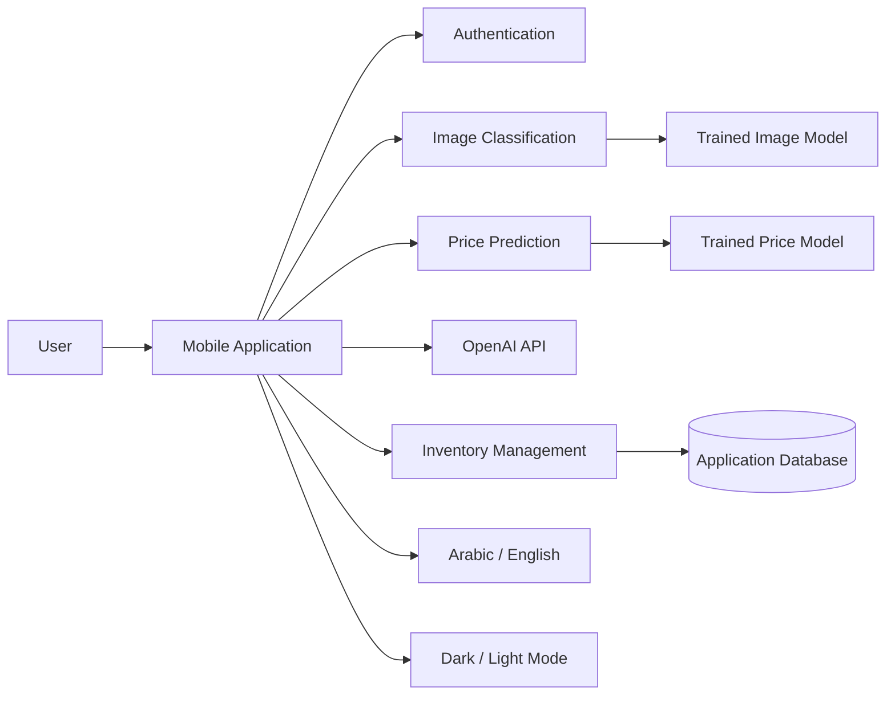
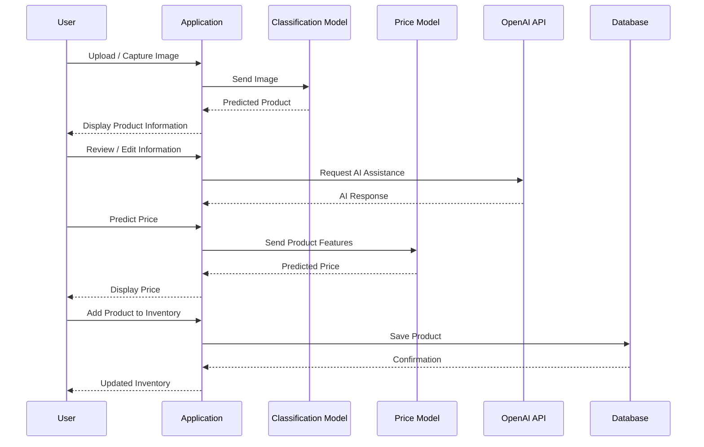

# Pill Scan AI — System Overview

## 1. Application Overview

Pill Scan AI is an AI-powered application that combines image classification, price prediction, OpenAI services, and inventory management in one workflow.

The main purpose is to allow a user to scan a pill/product, identify it using a trained image-classification model, review or modify the detected information, predict its price, and optionally save the product to an inventory.

The application also provides Arabic/English language support and dark/light themes.

---

## 2. Main Application Workflow



---

## 3. Core Components

### Image Classification

The application receives a product image from the user and sends it to the existing trained image-classification model.

```text
Image
  ↓
Preprocessing
  ↓
Trained Classification Model
  ↓
Predicted Class
  ↓
Product Information
```

The classification model is based on a dataset of product/pill images.

### Price Prediction

After the product has been identified and its information is confirmed, the application can predict its price.

```text
Product Features
      ↓
Data Preprocessing
      ↓
Price Prediction Model
      ↓
Estimated Price
```

The price-prediction model is trained using structured data stored in an Excel dataset.

### OpenAI Integration

The application uses the paid OpenAI API as an additional AI service.

```text
User / Product Information
          ↓
       OpenAI API
          ↓
 AI-generated assistance
```

This integration complements the application's own machine-learning models rather than replacing them.

### Inventory Management

Products can be managed after identification and price prediction.

```text
                 Inventory
                    |
        ┌───────────┼───────────┐
        ↓           ↓           ↓
       Add         Edit       Delete
        ↓           ↓           ↓
              Product Data
```

---

## 4. System Architecture



---

## 5. Data Flow



---

## 6. Inventory Data Structure

A simplified product record can contain:

```text
Product
├── ID
├── Name
├── Category
├── Description
├── Classification Result
├── Product Features
├── Predicted Price
├── Quantity
├── Image
└── Created / Updated Date
```

---

## 7. User Interface

The application supports:

| Feature | Support |
|---|---|
| English | Yes |
| Arabic | Yes |
| RTL Layout | Yes |
| Light Mode | Yes |
| Dark Mode | Yes |
| Image Scanning | Yes |
| Price Prediction | Yes |
| AI Assistance | Yes |
| Inventory Management | Yes |

---

## 8. AI Components Summary

| Component | Input | Source / Training |
|---|---|---|
| Image Classification | Product image | Existing trained image dataset |
| Price Prediction | Product/structured features | Excel dataset |
| OpenAI Integration | Product/user information | Paid OpenAI API |
| Inventory | Product information | Application database |

---

## 9. Complete Concept

```text
                    PILL SCAN AI
                         │
              ┌──────────┴──────────┐
              │                     │
          Scan Product          User Interface
              │                     │
              ↓               ┌─────┴─────┐
     Image Classification     │           │
              │            Arabic/English │
              ↓            Dark/Light     │
      Product Information                │
              │                           │
       ┌──────┴──────┐                    │
       │             │                    │
       ↓             ↓                    │
  OpenAI API    Price Prediction          │
       │             │                    │
       │             ↓                    │
       │       Predicted Price            │
       │             │                    │
       └──────┬──────┘                    │
              ↓                           │
         Inventory ◄──────────────────────┘
              │
       ┌──────┼──────┐
       ↓      ↓      ↓
      Add    Edit   Delete
```

## 10. Technology / Tool Areas

The project is composed of several main technology areas:

- **Machine Learning:** Image classification and price prediction.
- **Computer Vision:** Processing product/pill images for classification.
- **OpenAI API:** Additional AI-powered assistance.
- **Structured Data:** Excel dataset for price-model training.
- **Database:** Storage and management of inventory information.
- **Mobile Application:** User-facing scanning, prediction, and inventory workflows.
- **Internationalization:** Arabic and English support with RTL handling.
- **UI Theming:** Dark and light mode support.
